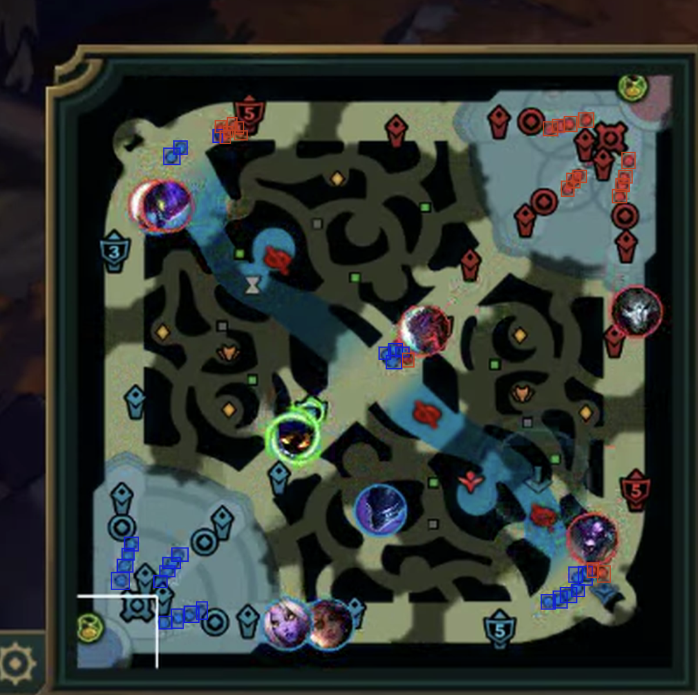
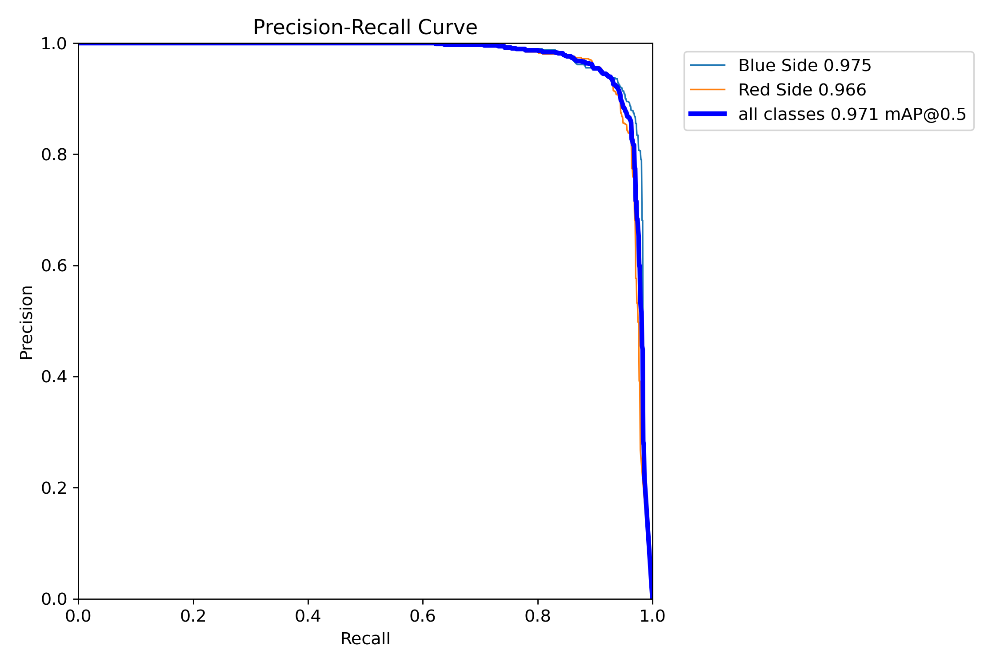
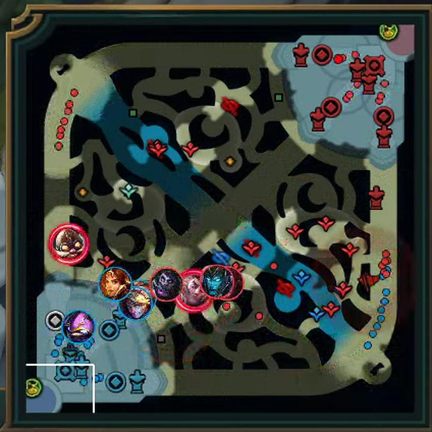
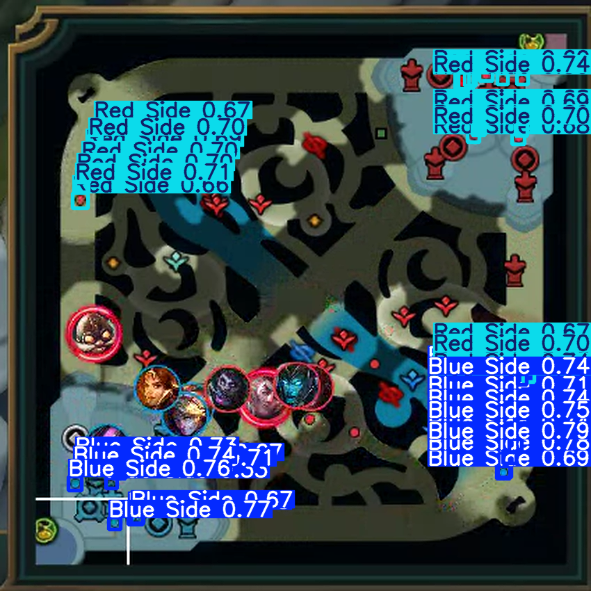

# League of Legends Minion Wave Collision Analysis

## 📌 Project Overview
This project analyzes minion wave behavior in League of Legends by detecting minions in video footage and identifying the collision points of red and blue minion waves in each lane. The goal is to provide insights into wave control and lane dynamics.

## 🏆 Objective
The primary focus of this project is to gather information on **wave positions in professional League of Legends matches** since it is not provided by Riot nor its official data partner GRID. To achieve this, the following process is followed:

1. **Labeling images of minions on the minimap to develop a CV model**
2. **Developing a Computer Vision model (YOLOv8) for detection**
3. **Extracting videos of professional matches**
4. **Processing videos to detect minions in real game time**
5. **Enhancing the dataset with additional game data**
6. **Calculating the final wave positions per lane**

## 🔬 Step 1: Labeling Images for Training
To train a computer vision model, the first thing that should be done is labeling images. In this process, you have to gather as much images as possible from your topic and manually tag them whenever you see what you need to find. In my case, I need to label images from LOL games looking for minions dots in minimap. Funny part here is that I used my own SoloQ matches for this process since that was enough and easier to gather, but it is important to do it in the same quality that you should expect to gather real images later.

In order to tag them, I used **LabelImg**. It's a simple environment designed for this purpose, free and easy to use. You just need to:

- Upload your own images to the platform (I chopped my games videos to images and selected random moments from them)
- Annotating manually each minion’s position as **bounding boxes**.
- Ensuring the labels correctly distinguish between the level of granularity you need. In my case, I just went for distinguishing red and blue minions.

📷 *Example of labeled image (before-after):*

## 🤖 Step 2: Training the Detection Model
Once I had the images labeled, I just downloaded them from LabelImg in yolo format in order to train a Computer Vision model on them. Yolo format is just a repository where you have two folders: images and labels (where you have plain text docs for every image with the position of the bounding boxes and its class).

A **YOLOv8-based** computer vision model was trained using the labeled images to accurately detect minions. Training setup:

- **Dataset:** 300 labeled frames
- **Training epochs:** 100

I was not fully confident on sharing this numbers since I am aware that this is not an ideal environment to CV developing. Wherever you read, 300 frames are surely a low number of images to train a model. 100 epochs is cool, even you could go for more. However, since we had a lot of minions in every frame and we are dealing with really similar images and things to look for (small blue-red dots, almost always in the same part of the images), I gave it a try and results where promising. And yes, labeling time was also an issue to stop at 300 manually tagged images.

- **Accuracy Results:**
  - **Precision-Recall Score:** 97.1%
  - **Mean Average Precision (mAP):** 95.3%

📊 *Precision-Recall Curve:*

📊 *Results example (before-after:*

*Additional tests included evaluating detection performance on unseen games.*

## 🎥 Step 3: Extracting Match Videos
As a data analyst, once I had developed a reliable CV model I thought that toughest part had already gone. What an idiot I was.

Next step of the process involved gathering official competitive LOL games in order to look for minions in its frames. And since I am a part of ZETA Gaming, I had easy access to the videos via Riot's official data provider: GRID. But League of Legends matches are stored as **ROFL replay files**. However, **Riot does not provide an official method to watch them or extract them as videos once its patch is not live patch anymore** (WTF).

Since live patches are constantly updated, pro games were 99% outdated and unavailable to be reproduced. I did even ask GRID if they had an official statement on how to do this, but they said NO. Thankfully, LOL community is one of the strongest I've ever seen and they gave me the help I needed (thanks Pablo, Julia and Fire). So I used:
- **ReplayBook** to play the replays.
- **Replays.xyz** to get older LOL clients.
- The full matches were recorded (x8 speed, max quality) and stored in the 'highlights' folder for processing.

## 🛠️ Step 4: Processing Videos for Minion Detection
With the trained YOLOv8 model, the next step was **processing the match footage to extract minion positions**. This process could be described in the following steps:

- **Splitting video frames** at regular intervals (1 sec).
- **Running YOLOv8 detection** on each frame.
- **Mapping detected minimap coordinates** to real in-game map positions (**X: 0-14750, Y: 0-14850**).
- **Extracting timestamps** using OCR to synchronize data with game time.

This is the most complex step of the process, but also the most rewarding one. I had to deal with CV Models and OCR Image processing at the same time for the first time in my life. Yet, once you understand the basics you can develop a fully automated process which actually fulfills this project's goal: reading videos and detecting minion positions in every timestamp.

Note that image processing would only give pixel info about where minions are in the frame given. Transforming those "coordinates" into real LOL coordinates was a carefully hand-crafted process since -again- there's no real evidence about map full coordinates from official sources.

## 📊 Step 5: Enhancing Data with Additional Game Information
Almost reaching the end... Let's keep up the pace.

This could easily be the most understimated part of the process. Image detection is surely sophisticated and interesting, but there's always an error margin to be assumed. Minions can be detected from a lot of spots in the minimap, not only actual minions. So further data processing should be done in order to properly increase data accuracy.

To improve the dataset and clean potential inaccuracies, I incorporated:

1. **Lane coordinates**, helping structure minion movement into distinct lanes.
2. **GRID data** on **champion attacks on minions**.
3. **Turret locations & destruction state**, since **turrets stop minion waves when they are alive**.

Champion attacks on minions is the trickiest one, yet the most important since most of the time champ images will overlap minion dots on minimap. There's no "minion damage" on GRID data, so I have to calculate it substracting different types of damage to "Total Damage Dealt". This variable allowed to detect most of the minions estimated positions through the match. 

## 🌊 Step 6: Determining the Wave Position at Each Timestamp
Using the cleaned dataset, the final step was identifying **wave positions per lane**. Finally, classic data analysis, no more complex image processing nor data cleaning issues.

In order to obtain wave positions, I had to **group minions into waves** based on proximity and then find the **wave closest to the enemy nexus**. Not as easy as it looks taking into account everything explained about accuracy issues, but I managed to get something quite consistent. Once I had it, I just needed to get clash point (where both waves from blue-red will stop and start to fight) by finding the medium lane point between them. 

Et voilà, c'est fini.

## 📊 Data and Results
This repository contains processed data and visualizations derived from the analysis. Feel free to explore them and contact me with any doubt or further developing. 

The following resources are available:

### 📁 Data (`/data/`)
- **`processed_video.webm`** → Converted video file used for minion detection.
- **`minion_detections.csv`** → CSV containing detected minion positions per second.
- **`wave_collisions_2025.csv`** → Coordinates of wave collision points for analyzed games.

### 📁 Visuals (`/visuals/`)
- **`original_frame.png`** → Original frame uploaded to LabelImg.
- **`labeled_frame.png`** → Final frame after labeling minions in LabelImg.
- **`pr_curve_val.png`** → Precision recall curve in validation data.
- **`original_frame2.png`** → Original frame to be processed and find minions.
- **`processed_frame.png`** → Processed frame with detected minions around the image.
- **`wave_movement_analysis.png`** → Visual representation of wave movements over time.

## 🔍 Insights and Applications
This dataset and visualization can be useful for:
- Understanding how minion waves interact in different lanes.
- Evaluating how external factors (jungle pressure, player intervention) influence wave collisions.
- Optimizing macro strategy based on wave dynamics.
- Analyzing **wave positioning in teamfights and objective control**.
- Studying **post-wave push decisions** and their impact on lane management.

## 👀 Community Involvement
I invite the community to explore the results and help find new ways to leverage this data. Some possible areas of interest include:
- **Improving any step from the process**, specially managing rofl files and obtaining videos from competitive matches.
- **Wave positioning during teamfights**
- **Impact of wave state on objective fights** (dragons, baron, turrets)
- **Best actions after pushing a wave** (roaming, invading, resetting, etc.)

## ❗ Limitations
- **No raw video data included**: To maintain processing confidentiality, only processed results are provided.
- **No implementation details**: The minion detection method and exact process are not shared to preserve proprietary methods.

## 📢 Contact & Contributions
This project is shared for analytical and discussion purposes. If you have insights or ideas to expand the analysis, feel free to open a discussion or reach out ([Twitter: @jperezlafuente](https://twitter.com/jperezlafuente))!

---
